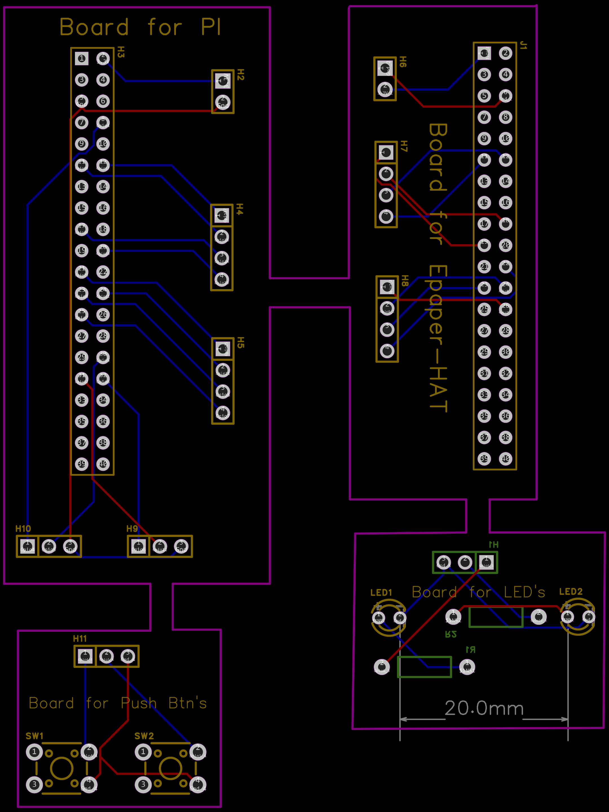
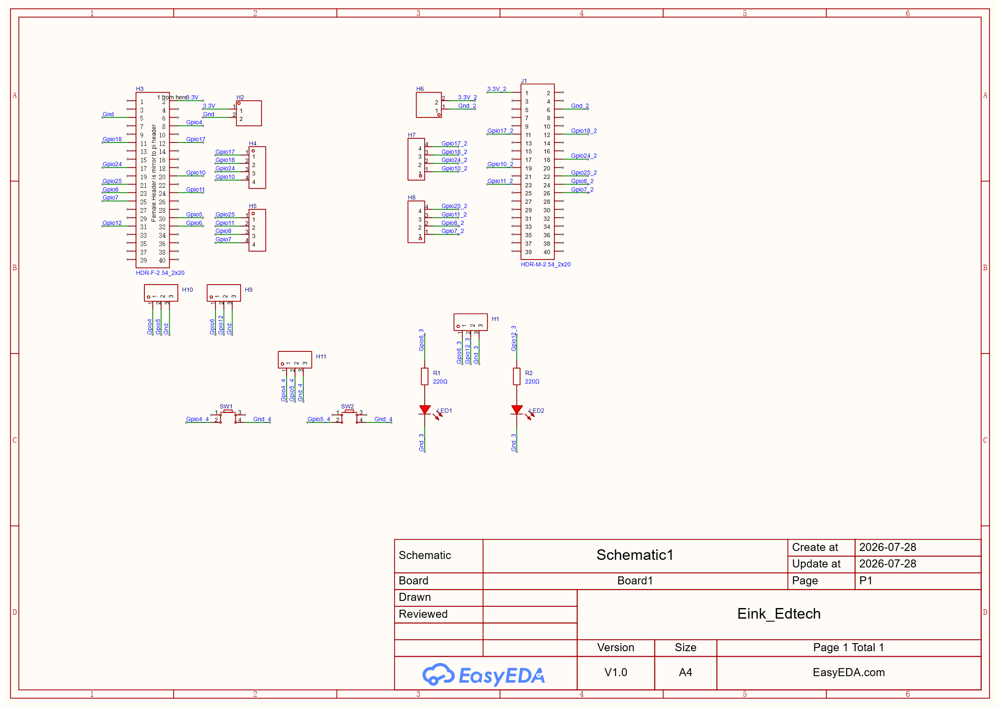

# AutoRefresh Notes

## Write in Pi

```
crontab -e
```

### Auto refresh every 30 minutes

```
*/30 7-22 * * * /home/robotpi/einkenv/bin/python3 /home/robotpi/Eink/RaspberryPi/python/examples/calendar_weekly_art.py --no-picker >> /home/robotpi/calendar.log 2>&1
```

### Auto refresh on a specific minute of every hour

```
5 7-22 * * * /home/robotpi/einkenv/bin/python3 /home/robotpi/Eink/RaspberryPi/python/examples/calendar_weekly_art.py --no-picker >> /home/robotpi/calendar.log 2>&1
```

> Runs on the 5th minute of every hour from 7am to 10pm (24-hour format, `22` = 10pm).

---

## UI Design & Auto-Refresh Workflow

- Use **`epaper_designer.py`** to design your layout.
- After designing, save the PNG for reference and save the config under the name **`layout.json`** — this is what `epaper_refresh.py` reads on every auto-refresh.
- Use **`epaper_refresh.py`** inside `crontab -e` for auto-refresh.

---

## GUI (created for Raspberry Pi)

Located inside the `GUIsetup` directory.

- Use **`epaper_designer.py`** to design your layout — either on a PC or on the Pi — and save the config as **`layout.json`**.
- Use **`epaper_refresh.py`** in `crontab -e` for auto-refresh.
  - `layout.json` must be in the **same folder** as `epaper_refresh.py`.
  - In crontab, give the execute command with `python3` followed by the path to the script file (see the AutoRefresh section above).
- If your libraries and tools live inside a **venv**, run `python3` from inside that venv when executing the script (see the AutoRefresh section above for more info).

---

## Some Electrical Notes

### PCB Routing Diagram



| Element | Meaning |
|---|---|
| 🟩 Green header | Connected from the **bottom** side |
| 🟨 Yellow header | Connected from the **top** side |
| 🟪 Purple line | Board **outline** |
| 🔵 Blue line | Routing done from the **bottom** side |
| 🔴 Red line | Routing done from the **top** side |
| `R` | Resistor |
| `H` / `J` | Headers |
| `SW` | Button/switch |
| `LED` | LED |

### Schematic Diagram


